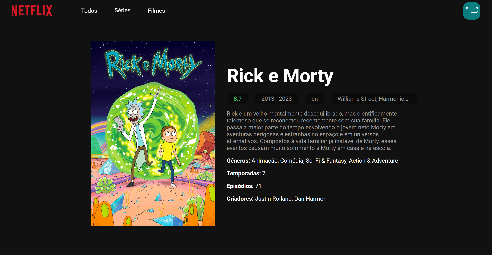
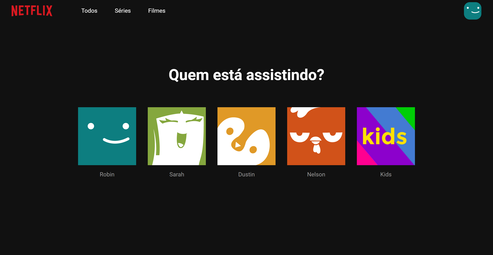

# Netflix Clone 🎥


<p align="center">
    <video src="./public/images/main.mp4"></video>
</p>

<p align="center">
    <a href="#about">About |</a> 
    <a href="#started">Getting Started</a> 
    <a href="#routes">| App Routes</a> 
</p>

<h2 id="about">📌 About</h2>

This project is a Netflix clone, made to test knowledge in React. The <a href="https://www.themoviedb.org">TMDB API</a> was used and several features were added, such as: selection of the user's photo and storage in localStorage, filter by films and series or by all, option to see more precise details of each film.

<h2 id="started">🚀 Getting started</h2>

To run locally, you must have an access key for the TMDB Api and install the prerequisites

<h3>Cloning</h3>

```bash
git clone https://github.com/RafaelHDSV/Netflix-Clone.git
npm install
```

<h3>Starting</h3>

```bash
cd netflix-clone
npm start
```

or [Open URL Project](https://netflix-clone-rafael.vercel.app)

<h2 id="routes">📍 Application Routes</h2>

There are basically such routes on the website, where you can navigate them at any time
​
| route | description  
|----------------------|-----------------------------------------------------
| <kbd>/</kbd> | home page where you can see all the films
| <kbd>/movie</kbd> | page to get more detailed information about the selected film
| <kbd>/user</kbd> | page to select the user icon
| <kbd>/_error_</kbd> | page when the route does not exist or is not found

<hr/>

### route: <kbd>/</kbd>


<hr/>

### route: <kbd>/movie</kbd>

-    movie
     

-    tv
     

<hr/>

### route: <kbd>/user</kbd>


